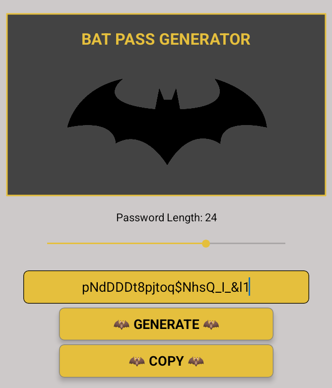

# Bat Pass Generator 🦇

A React Native mobile application for generating secure passwords with a Batman theme. The app features a sleek dark interface with bat-themed styling and animations.



## Features

- 🔐 Generate secure passwords with customizable length (8-32 characters)
- 📋 One-tap copy to clipboard with visual feedback
- 🎨 Batman-themed UI with animated logo
- 📱 Responsive design for mobile devices
- 🎯 Password length slider for easy customization

## Tech Stack

- React Native
- Expo
- TypeScript
- React Native Community Slider

## Getting Started

### Prerequisites

- Node.js (v14 or higher)
- npm or yarn
- Expo CLI
- iOS Simulator (for Mac) or Android Emulator

### Installation

1. Clone the repository:
```bash
git clone https://github.com/yourusername/bat-pass-app.git
cd bat-pass-app
```

2. Install dependencies:
```bash
npm install
# or
yarn install
```

3. Start the development server:
```bash
npm start
# or
yarn start
```

4. Run on your preferred platform:
- Press `i` for iOS simulator
- Press `a` for Android emulator
- Scan QR code with Expo Go app for physical device

## Usage

1. Use the slider to select your desired password length (8-32 characters)
2. Tap the "GENERATE" button to create a new password
3. Tap the "COPY" button to copy the password to your clipboard
4. Watch the bat logo animate when copying!

## Contributing

Contributions are welcome! Please feel free to submit a Pull Request.

## License

This project is licensed under the GPLv2 License - see the [LICENSE](LICENSE) file for details.

## Acknowledgments

- Batman logo and theme inspired by DC Comics
- Built with React Native and Expo 